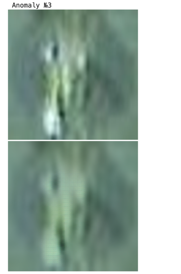
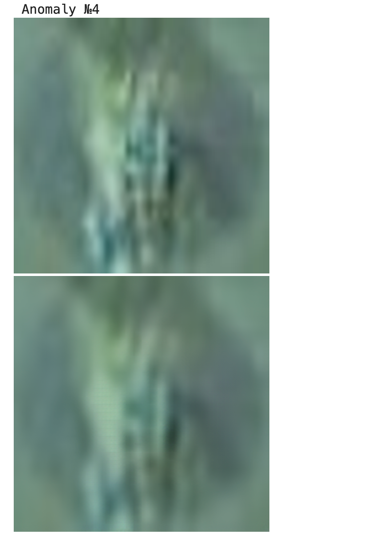

# ДЗ 1
- Задача - Множественная классификация
- Датасет - CIFAR-10 (целиком)
- Архитектура - EfficientNet
- Гиперпараметры:
  - оптимайзер: Adam 
  - lr: 0.001, scheduler каждые 10 эпох умножает на 0.4.
  - epoch: 50
  - batch: 64

### Результаты обучения
Также проводил экспериментальный запуск с scheduler каждые 5 эпох
и умножением на 0.5, но выбранные гиперпараметры показали себя лучше.\

Графики можно посмотреть в wandb:\
https://wandb.ai/kavesnin-hse/Homework-1.

Также прикрепляю графики matplotlib здесь, они в более удобном формате.\
\
\
**Лосс, train=0.8065, test=0.8897**:

**Average Precision=0.7141, Recall=0.7156, F1=0.7146**:

**Per class Precision, Recall, F1**:

- airplane: Precision=0.7459, Recall=0.7720, F1=0.7587 
- automobile: Precision=0.7981, Recall=0.8300, F1=0.8137 
- bird: Precision=0.6421, Recall=0.6280, F1=0.6350 
- cat: Precision=0.5278, Recall=0.5130, F1=0.5203 
- deer: Precision=0.6697, Recall=0.6610, F1=0.6653 
- dog: Precision=0.6333, Recall=0.6010, F1=0.6167 
- frog: Precision=0.7691, Recall=0.8060, F1=0.7871 
- horse: Precision=0.7262, Recall=0.7480, F1=0.7369 
- ship: Precision=0.8213, Recall=0.8180, F1=0.8196 
- truck: Precision=0.8073, Recall=0.7790, F1=0.7929

### Примеры работы модели

