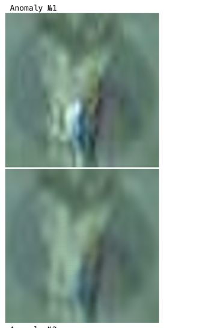
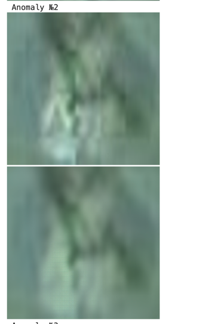

# ДЗ 2
- Задача - Детекция аномалий
- Датасет - [Ссылка на датасет](https://drive.google.com/file/d/1DHuQ3DBsgab6NtZIZfAKUHS2rW3-vmtb/view)
- Архитектура - Custom AutoEncoder Convolutions-DeConvolutions
- Гиперпараметры:
  - оптимайзер: Adam 
  - lr: 0.001, scheduler каждые 5 эпох умножает на 0.5.
  - epoch: 15
  - batch: 64

### Результаты обучения
Каждую эпоху логировал не только train и val loss-ы, но и выполнял
автоматический подбор threshold-а и оценку по нему на тестовом датасете.
То есть TPR и TNR также логировались в wandb. 

После первого запуска удалось выбить следующие метрики:
  - True Positive Rate: 0.775
  - True Negative Rate: 0.989

Провёл эксперимент, в котором сделал меньше параметров модели. 
Цель: улучшить метрики.
Идея: уменьшить кол-во параметров AutoEncoder, чтобы кодировалось менее качественно и повысилась чувствительность к аномалиям.
Результат:
  - True Positive Rate: 0.930
  - True Negative Rate: 0.829

Вывод: Сложно сравнивать графики обучений, потому что tpr выше у одного запуска, а tnr - у другого. 

В качестве второго эксперимента попробовал переписать функцию calculate_threshold, чтобы это дело как-то нормализовать.
Идея: Учитывать при подборе порога не только proliv, но и данные без аномалии (val-датасет). 
Тогда порог должен лучше подстраиваться под точность для данных без аномалии. 
Искать не через пороги roc-curve, а через бинарный поиск.

Результат:
  - True Positive Rate: 0.9302325581395349
  - True Negative Rate: 0.8223738062755798

Вывод: подбор threshold-а не поменялся, порог подбирался верной стратегией, 
и сдвигать его для баланса на тестовых данных было бы переобучением на тестовых данных.

Все графики можно посмотреть в wandb:\
https://wandb.ai/kavesnin-hse/Homework-2.

### Примеры работы модели на proliv-датасете

